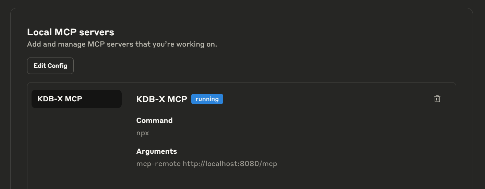
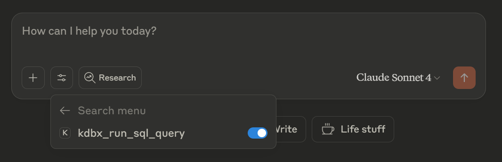
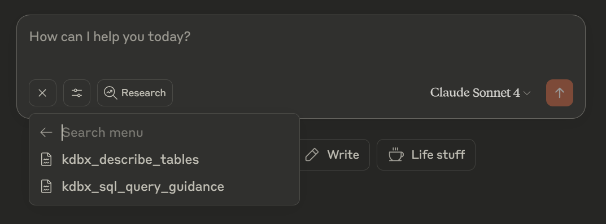

# KDB-X MCP Server

This server enables end users to query KDB-X data through natural language, providing production-grade resources, prompts, and tools for seamless data interaction.

Built on an extensible framework with configurable templates, it allows for intuitive extension with custom integrations tailored to your specific needs.

The server leverages a combination of curated resources, intelligent prompts, and robust tools to provide appropriate guardrails and guidance for both users and AI models interacting with KDB-X.

## Table of Contents

- [Prerequisites](#prerequisites)
- [Features](#features)
- [KDB-X Setup](#kdb-x-setup)
- [MCP Server Installation](#mcp-server-installation)
- [Transport Options](#transport-options)
- [Command line Parameters](#command-line-parameters)
- [Usage with Claude Desktop](#usage-with-claude-desktop)
- [Quickstart](#quickstart)
- [Prompts/Resources/Tools](#promptsresourcestools)
- [Development](#development)
- [Troubleshooting](#troubleshooting)

## Prerequisites

Before installing and running the KDB-X MCP Server, ensure you have:

- A `KDB-X` service listening on a host and port that will be accessible to the MCP Server - see [example](https://docs.kx.com/public-preview/kdb-x/How_to/use-the-q-terminal.htm#use-command-line-options)
  - KDB-X can be installed by signing up to the [kdb-x public preview](https://kdb-x.kx.com/sign-in) - see [KDB-X documentation](https://docs.kx.com/public-preview/kdb-x/home.htm) for supporting information
  - KDB-X is supported on Linux/WSL/Mac
  - Windows users can run the KDB-X MCP Server on Windows and connect to a local/remote KDB-X database
  - Windows users can run a local KDB-X database by installing KDB-X on [WSL](https://learn.microsoft.com/en-us/windows/wsl/install), and use the default [streamable-http transport](#transport-options) when running the [KDB-X MCP Server](#run-the-server)
- [UV Installed](https://docs.astral.sh/uv/getting-started/installation/)
- [Claude Desktop](https://claude.ai/download) or another MCP-compatible client installed
- [NPX](https://nodejs.org/en) is required to use `streamable-http` transport with Claude Desktop
  - If you are using a different MCP Client then `npx` may not be required - consult the documentation of your chosen MCP Client
  - `npx` comes bundled with the [nodejs](https://nodejs.org/en) installer
  - See [example configuration with streamable-http](#example-configuration-with-streamable-http)

> Note: For details on KDB-X usage restrictions see [documentation](https://docs.kx.com/product/licensing/usage-restrictions.htm#kdb-x-personal-trial-download)

## Features

- **SQL Interface to KDB-X**: Run SELECT SQL queries against KDB-X databases
- **Built-In Query Safety Protection**: Automatic detection and blocking of dangerous SQL operations like INSERT,DROP,DELETE etc.
- **Smart Query Result Optimization**: Smart result truncation (max 1000 rows) with clear messaging about data limits
- **SQL Query Guidance for LLM**: Comprehensive LLM-ready MCP resource (file://guidance/kdb-sql-queries) with syntax examples and best practices
- **Database Schema Discovery**: Explore and understand your database tables and structure using the included MCP resource for quick, intelligent insights.
- **Auto-Discovery System**: Automatic discovery and registration of tools, resources, and prompts from their respective directories
- **Resilient Connection Management**: Robust KDB-X connection handling with automatic retry logic and connection caching
- **Ready-Made Extension Template**: Ready-to-use templates for tools, resources, and prompts with best practices and documentation for extending functionality
- **Unified Intelligence: Prompts, Tools & MCP Resources Working Together**: A powerful combination of intelligent prompts, purpose-built tools, and curated MCP resources—all working together to deliver fast, optimized, and context-aware results.
- **HTTP Streamable Protocol Support**: Supports the latest MCP streamable HTTP protocol for efficient data flow, while automatically blocking the deprecated SSE protocol.

## KDB-X Setup

The KDB-X MCP server communicates with the KDB-X service using its SQL interface.

Ensure that the SQL interface is loaded on the KDB-X service — if it's not, you can load it manually by running:

```q
.s.init[]
```

## MCP Server Installation

### Clone the repository

```bash
git clone https://github.com/KxSystems/kdb-x-mcp-server.git
cd kdb-x-mcp-server
```

### Run the server

The server will start with `streamable-http` transport by default

```bash
uv run mcp-server
```

## Transport Options

For more info on the supported transports see official documentation

- [streamable-http](https://modelcontextprotocol.io/docs/concepts/transports#streamable-http)
- [stdio](https://modelcontextprotocol.io/docs/concepts/transports#standard-input%2Foutput-stdio)

> Note: We don't support [sse](https://modelcontextprotocol.io/docs/concepts/transports#server-sent-events-sse-deprecated) transport (server-sent events) as it has been deprecated since protocol version 2024-11-05.

## Command line Parameters

```bash
uv run mcp-server -h
usage: mcp-server [-h] [--streamable-http | --stdio] [--kdbx-mcp-port KDBX_MCP_PORT]
                  [--kdbx-host KDBX_HOST] [--kdbx-port KDBX_PORT]
                  [--kdbx-timeout KDBX_TIMEOUT] [--kdbx-retry KDBX_RETRY]

KDB-X MCP Server

options:
  -h, --help            show this help message and exit
  --streamable-http     Start the KDB-X MCP server with streamable HTTP transport (default)
  --stdio               Start the KDB-X MCP server with stdio transport
  --kdbx-mcp-port KDBX_MCP_PORT
                        Port number the KDB-X MCP server will listen on when using streamable-http
                        transport (default 8000)
  --kdbx-host KDBX_HOST
                        KDB-X host that the MCP server will connect to (default: localhost)
  --kdbx-port KDBX_PORT
                        KDB-X port that the MCP server will connect to (default: 5000)
  --kdbx-timeout KDBX_TIMEOUT
                        KDB-X connection timeout in seconds (default: 1)
  --kdbx-retry KDBX_RETRY
                        KDB-X connection retry attempts (default: 2)
```

**Environment Variables:**

- `KDBX_MCP_TRANSPORT`: Set transport mode (streamable-http, stdio)
- `KDBX_MCP_PORT`: Set port number (default: 8000)
- `KDBX_MCP_HOST`: Set host address (default: 127.0.0.1)
- `KDBX_MCP_SERVER_NAME`: Set server name (default: KDB-X_Demo)
- `KDBX_LOG_LEVEL`: Set logging level (default: INFO)
- `KDBX_HOST`: KDB-X server hostname (default: localhost)
- `KDBX_PORT`: KDB-X server port (default: 5000)
- `KDBX_USERNAME`: KDB-X username (optional)
- `KDBX_PASSWORD`: KDB-X password (optional)

**Configuration Priority:**

1. **CLI flags** (highest precedence) - `--streamable-http`, `--kdbx-port 8000`, `--kdbx-host myhost`
2. **Environment variables** (middle precedence) - `KDBX_MCP_TRANSPORT=streamable-http`, `KDBX_HOST=myhost`
3. **Default values** (lowest precedence)

## Usage with Claude Desktop

### Configure Claude Desktop

Claude Desktop requires a `claude_desktop_config.json` file to be available.

Add one of the example configs below, to the default configuration file location for your OS.

| Platform | Default Configuration File Location |
|----------|---------------------------|
| macOS | `~/Library/Application Support/Claude/claude_desktop_config.json` |
| Windows | `%APPDATA%\Claude\claude_desktop_config.json` |

### Example configuration with streamable-http

To configure Claude Desktop with KDB-X MCP Server using `streamable-http`, copy the below example into an empty `claude_desktop_config.json` file.

If you have pre-existing MCP servers see [example config with multiple mcp-servers](#example-configuration-with-multiple-mcp-servers)

```json
{
  "mcpServers": {
    "KDB-X MCP streamable": {
      "command": "npx",
      "args": [
         "mcp-remote",
         "http://localhost:8000/mcp"
      ]
    }
  }
}
```

**Note**

- To use `streamable-http` with Claude Desktop you must have `npx` installed and available on your path - you can install it via [nodejs.org](https://nodejs.org/en)
- You will need to start the MCP Server as a standalone python process. See section [Run the server](#run-the-server)
- Ensure you have the correct endpoint - in this example our KDB-X MCP server is running on port `8000`.
- This means you will be responsible for starting and stopping the MCP Server, Claude Desktop will only access it via `npx`
- MCP logs will be visible from your terminal

#### Example configuration with stdio

To configure Claude Desktop with KDB-X MCP Server using `stdio`, copy this into an empty `claude_desktop_config.json` file.

If you have pre-existing MCP servers see [example config with multiple mcp-servers](#example-configuration-with-multiple-mcp-servers)

```json
{
  "mcpServers": {
    "KDB-X MCP stdio": {
      "command": "/Users/<user>/.local/bin/uv",
      "args": [
        "--directory",
        "/path/to/this/repo/",
        "run",
        "mcp_server"
      ]
    }
  }
}
```

**Note**

- Update your `<user>` to point to the absolute path of the uv executable - only required if `uv` is on your path
- Update the `--directory` path to the absolute path of this repo
- Currently `KDB-X` does not support Windows, meaning `stdio` is not an option for Windows users
- Claude Desktop is responsible for starting/stopping the MCP server when using `stdio`
- When using `stdio` the MCP logs will be available at [Claude Desktop's MCP Log Location](#claude-log-locations)

#### Example configuration with multiple MCP servers

You can include multiple MCP servers like this

```json
{
  "mcpServers": {
    "KDB-X MCP streamable": {
      "command": "npx",
      "args": [
         "mcp-remote",
         "http://localhost:8000/mcp"
      ]
    },
    "Another MCP Server": {...}
  }
}
```

For detailed setup instructions, see the [official Claude Desktop documentation](https://claude.ai/docs/desktop).

### Validate Claude Desktop Config

1. If you are using `streamable-http` you will need to start the MCP Server in a separate terminal window, and ensure it remains running. If you are using `stdio` skip to step 2.
2. Once the `claude_desktop_config.json` has been added, with your chosen transport config, restart Claude Desktop. Then navigate to `File` > `Settings` > `Developer`. You should see that your KDB-X MCP Server is running.
   - Windows users: make sure to quit Claude Desktop via the system tray before restarting.

   
3. From a chat window click the `search and tools` icon just below the message box on the left. You’ll see your MCP server listed as `KDB-X MCP`. Click it to access the `kdbx_run_sql_query` tool.

   
4. Click the '+' in the chat window, then select `Add from KDB-X MCP` to view the list of available resources.

   

## Quickstart

To demonstrate basic usage of this tool, using an empty KDB-X database, follow the quickstart steps below.

1. Open a KDB-X q session

   ```bash
   q -p 5000
   ```

2. Load the sql interface

   ```q
   .s.init[]
   ```

3. Add a dummy table e.g. `trade`

   ```q
   rows:10000;
   trade:([]time:.z.d+asc rows?.z.t;sym:rows?`AAPL`GOOG`MSFT`TSLA`AMZN;price:rows?100f;size:rows?1000);
   ```

4. Start your MCP server - you may start it from this repo via `uv run mcp-server`, or in the case of `stdio` we will let Claude start it in the next step.

5. Start Claude Desktop and verify that the tools and prompts outlined in the [Validate Claude Desktop Config](#validate-claude-desktop-config) section are visible.

6. **Load database context**: Select the `kdbx_describe_tables` and `kdbx_sql_query_guidance` resources to add them to your conversation. This will give your MCP client an overview of your database structure and available tables, along with guidance on writing effective SQL queries.

7. **Explore specific tables**: Use the `kdbx_table_analysis` prompt to get detailed analysis and insights about individual tables in your database.

8. **Ask questions in natural language**: Interact with your KDB-X database using plain English. Your MCP client will automatically use the `kdbx_run_sql_query` tool to execute the appropriate queries based on your requests.

## Prompts/Resources/Tools

### Prompts

| Name | Purpose | Params | Return |
|-------------------|------------------------------------------|-------------------------------------------------|------------------------------------------------|
| kdbx_table_analysis | Generate a detailed analysis prompt for a specific table. | table_name: Name of the table to analyze<br> analysis_type (optional): Type of analysis options statistical, data_quality<br> sample_size (optional): Suggested sample size for data exploration | The generated table analysis prompt |

### Resources

| Name | URI | Purpose | Params |
|---------------------|---------------------|--------------------------------------------------------------------------------------------|--------------------------------------------|
| kdbx_describe_tables | kdbx://tables | Get comprehensive overview of all database tables with schema information and sample data. | None |
| kdbx_sql_query_guidance | file://guidance/kdbx-sql-queries | Sql query syntax guidance and examples to execute. | None |

### Tools

| Name | Purpose | Params | Return |
|-------------------|------------------------------------------|-------------------------------------------------|------------------------------------------------|
| kdbx_run_sql_query | Execute SQL SELECT against KDB-X database | query (str): SQL SELECT query string to execute | JSON object with query results (max 1000 rows) |

## Development

To add new tools:

1. Create a new Python file in src/mcp_server/tools/.
2. Implement your tool using the _template.py as a reference.
3. The tool will be auto-discovered and registered when the server starts.
4. Restart Claude Desktop to access your new tool.

To add new resources:

1. Create a new Python file in src/mcp_server/resources/.
2. Implement your resource using the _template.py as a reference.
3. The resource will be auto-discovered and registered when the server starts.
4. Restart Claude Desktop to access your new resource.

To add new prompts:

1. Create a new Python file in src/mcp_server/prompts/.
2. Implement your prompt using the _template.py as a reference.
3. The prompt will be auto-discovered and registered when the server starts.
4. Restart Claude Desktop to access your new prompt.

## Troubleshooting

### KDB-X connection error

Ensure that your KDB-X database is online and accessible on the specified kdb host and port.

The default KDB-X endpoint is `localhost:5000`, but you can update as needed via section [Command line Parameters](#command-line-parameters).

#### KDB-X SQL interface error

The KDB-X MCP server communicates with the KDB-X service using its SQL interface.

Ensure that the SQL interface is loaded on the KDB-X service — if it's not, you can load it manually by running:

```q
.s.init[]
```

### MCP Server port in use

If the MCP Server port is being used by another process you will need to specify a different port or stop the service that is using the port.

### Invalid transport

You can only specify `streamable-http`, `stdio.`

### Missing tools/resources

Review the Server logs for registration errors.

### Error when interacting with a KDB-X database

Ensure the KDB-X resources are loaded, so Claude knows how to interact with the database.

- `kdbx_describe_tables`
- `kdbx_sql_query_guidance`

### UV Default Paths

| Platform | Default UV Path |
|----------|----------------|
| **macOS** | `~/.local/bin/uv` |
| **Linux** | `~/.local/bin/uv` |
| **Windows** | `%APPDATA%\Python\Scripts\uv.exe` |

### Claude Log Locations

| Platform | Path | Monitor Command |
|----------|------|-----------------|
| **macOS** | `~/Library/Logs/Claude/mcp*.log` | `tail -f ~/Library/Logs/Claude/mcp*.log` |
| **Windows** | `%APPDATA%\Claude\Logs\mcp*.log` | `Get-Content -Path "$env:APPDATA\Claude\Logs\mcp*.log" -Wait` |

### Official Claude Troubleshooting docs

For detailed troubleshooting, see [official Claude MCP docs](https://modelcontextprotocol.io/quickstart/user#troubleshooting).

### Claude limits

You may need to upgrade to a paid plan to avoid Claude usage errors like this:

> Claude hit the maximum length for this conversation. Please start a new conversation to continue chatting with Claude.
