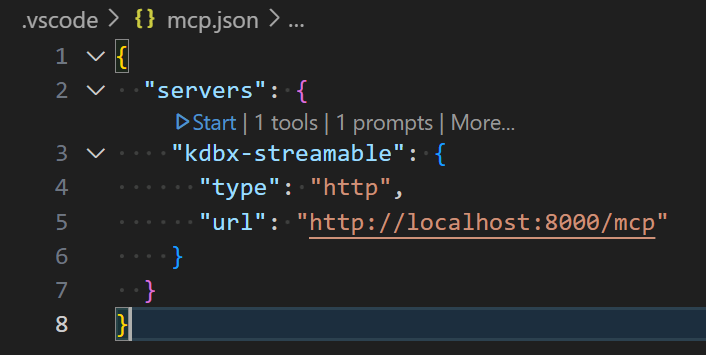
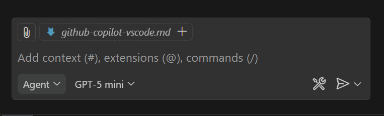
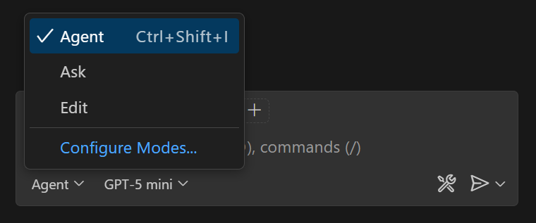
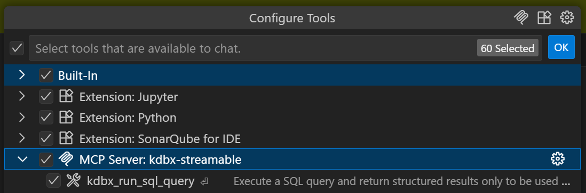

# GitHub Copilot VSCode Configuration Guide

This guide explains how to configure GitHub Copilot in VS Code with the KDB-X MCP Server.

## Table of Contents

- [Overview](#overview)
- [Prerequisites](#prerequisites)
- [Configuration](#configuration)
- [Validation](#validation)
- [Usage](#usage)
- [Troubleshooting](#troubleshooting)
- [Additional Resources](#additional-resources)

## Overview

GitHub Copilot in VS Code supports Model Context Protocol (MCP) servers (available since VS Code 1.102). This configuration allows you to use the KDB-X MCP Server directly with GitHub Copilot Chat, enabling natural language interactions with your KDB-X database.

## Prerequisites

- **VS Code version 1.102 or later**
- **Active GitHub Copilot subscription** (Free, Pro, Business, or Enterprise)
- **Organization policy enabled** (for Business/Enterprise users): The "MCP servers in Copilot" policy must be enabled by your administrator
- **KDB-X MCP Server installed** - See the [main README](../README.md#mcp-server-installation) for installation instructions

## Configuration

GitHub Copilot in VSCode can be configured with MCP servers in two locations:

1. **Workspace-level** (`.vscode/mcp.json` in your repository root)
   - **Required for WSL users** - this is the only option that works with WSL
   - Recommended for team collaboration - config is shared via git
   - Create `.vscode/mcp.json` manually in your project

2. **User-level** (`mcp.json` in VS Code user directory)
   - **Windows/macOS native only** - User-level does not work with WSL
   - For Windows users the User-level configuration is stored on the Windows filesystem (`%APPDATA%\Code\User\mcp.json`), which does not work well when VS Code is open in WSL
   - Use command palette > `MCP: Open User Configuration`
   - Config applies to all workspaces for that user

### Option 1: streamable-http Transport

This option requires manually starting the MCP server in a separate terminal. VS Code references this type as `http`.

Create or edit `.vscode/mcp.json` in your project:

```json
{
  "servers": {
    "kdbx-streamable": {
      "type": "http",
      "url": "http://localhost:8000/mcp"
    }
  }
}
```

**Note:**
- You must start the MCP Server manually (in a separate terminal) before using it: `uv run mcp-server`
- The server must remain running while you use it
- Default port is 8000 (can be changed with `--mcp.port`)
- MCP Server logs will be visible from your terminal
- Ensure you have the correct endpoint - update the port if you configured a different one

### Option 2: stdio Transport

This option allows VS Code to automatically start and stop the MCP server.

Create or edit `.vscode/mcp.json` in your project workspace:

```json
{
  "servers": {
    "kdbx-stdio": {
      "type": "stdio",
      "command": "uv",
      "args": [
        "--directory",
        "/path/to/kdb-x-mcp-server",
        "run",
        "mcp-server",
        "--mcp.transport",
        "stdio"
      ]
    }
  }
}
```

**Note:**
- Use **workspace configuration** (`.vscode/mcp.json`) rather than user-level config to avoid path resolution issues
- Update the `--directory` path to the absolute path of this repo
- VS Code is responsible for starting/stopping the MCP server when using `stdio`
- MCP logs will be visible from the [output tab](#vs-code-mcp-log-locations)

### Multiple MCP Servers

You can include multiple MCP servers in your configuration:

```json
{
  "servers": {
    "kdbx-streamable": {
      "type": "http",
      "url": "http://localhost:8000/mcp"
    },
    "another-server": {...}
  }
}
```

For detailed setup instructions, see the [official VS Code documentation](https://code.visualstudio.com/docs/copilot/customization/mcp-servers).

### Advanced Configuration Options

You can pass additional environment variables or command-line arguments to customize the MCP server behavior:

```json
{
  "servers": {
    "kdbx-stdio": {
      "type": "stdio",
      "command": "/Users/<user>/.local/bin/uv",
      "args": [
        "--directory",
        "/absolute/path/to/kdb-x-mcp-server",
        "run",
        "mcp-server",
        "--mcp.transport",
        "stdio",
        "--db.host",
        "localhost",
        "--db.port",
        "8082"
      ],
      "env": {
        "KDBAI_MCP_LOG_LEVEL": "DEBUG"
      }
    }
  }
}
```

For all available configuration options, see the [Command Line Tool](../README.md#command-line-tool) section in the main README.

## Validation

The configuration is working correctly when GitHub Copilot Chat shows the kdbx MCP server under Tools and the server tools are available for use.

Follow these steps to verify your configuration is working correctly:

1. **Start the server** (if using `streamable-http` transport):

   ```bash
   uv run mcp-server
   ```

   If using `stdio`, skip this step - VS Code will auto-start the server.

2. **Verify configuration file**:
   - Open `.vscode/mcp.json` in VS Code
   - Ensure there are no syntax errors (VS Code provides IntelliSense for validation)

3. **Start the MCP Client**:
   - From the `mcp.json` file you will see an inline option to start the client.
   - See streamable-http example below.



3. **Open GitHub Copilot Chat**:
   - Click the Copilot icon in the Activity Bar, or
   - Use the command palette: `GitHub Copilot: Open Chat`



4. **Enable Agent mode**:
   - Click the agent icon in the Copilot Chat interface



5. **Verify tools are available**:
   - Click the configure tools icon (🔧) in Copilot Chat
   - You should see the `kdbx` server listed with all available tools



## Usage

Once configured, you can interact with your KDB-X database using natural language in GitHub Copilot Chat. See the [Quickstart](../README.md#quickstart) guide for usage examples.

### Accessing MCP Tools

MCP tools are the primary way to interact with your KDB-X database. Tools are automatically available in GitHub Copilot Chat when Agent mode is enabled.

To enable Agent mode select `agent` from the chat interface (bottom left of the chat dialogue).

**Method 1: Natural Language (Recommended)**

Simply describe what you want to do in natural language, and Copilot will automatically select and invoke the appropriate KDB-X tools.

See [quickstart](../README.md#quickstart) for some usage examples.

**Method 2: Manual Tool Selection**

If Copilot doesn't automatically use the right tools, you can manually select one when running a query:

1. In the Copilot Chat input field, type `#`
2. Type `kdbx` to filter available tools
3. Select the specific tool you want
4. Then type your query or provide required parameters in natural language

**Method 3: View and Configure Tools**

1. **View available tools**: Click the tools icon (🔧) in the Copilot Chat view - you will see a list of available MCP Servers at the bottom
3. **Enable/disable servers**: Check or uncheck your MCP server (e.g., `kdbx-stdio` or `kdbx-streamable`)
4. **Enable/disable individual tools**: For a given MCP Server click `>` display all tools for that server, then toggle specific tools on/off

### Accessing MCP Resources

The KDB-X MCP server provides resources that can be added as context to your chat conversations. Unlike tools, resources are not automatically visible in the UI and must be explicitly accessed.

**Method 1: Command Palette**
1. Press `Ctrl+Shift+P` (Windows/Linux) or `Cmd+Shift+P` (macOS)
2. Run: `MCP: Browse Resources`
3. Select your kdbx MCP server
4. Choose the resource you want to add to the conversation

**Method 2: Chat Context**
1. In the Copilot Chat view, click the **Add Context** button (`📎` icon)
2. Select **MCP Resources**
3. Choose your kdbx server
4. Select the specific resource to add

**Method 3: Via MCP Server List**
1. Run: `MCP: List Servers` from the Command Palette
2. Select your kdbx MCP server
3. Choose **Browse Resources**

### Accessing MCP Prompts

The KDB-X MCP server provides pre-defined prompts for common tasks. Prompts are reusable workflows that guide Copilot through specific operations. Unlike tools, prompts are not automatically visible in the UI and must be explicitly accessed.

1. In the Copilot Chat input field, type `/` followed by the prompt name in this format:
   ```
   /mcp.<mcp-server-name>.<promptname>
   /mcp.kdbx-streamable.kdbx_table_analysis
   ```
   Replace `mcp-server-name` with the name of the server from your mcp.json file
   Replace `promptname` with the actual prompt from the kdbx-mcp-server

2. Press Enter to execute the prompt

3. **If the prompt requires arguments** (like `table_name`), VS Code will display a dialog (at the command palette) asking for the required parameters. Fill in the values and submit.

## Troubleshooting

### Server not appearing in Copilot

- Update VS Code to the latest version (1.102+)
- Verify GitHub Copilot is active: check the status bar
- Validate `.vscode/mcp.json` syntax (VS Code provides IntelliSense)
- Contact your administrator to enable the "MCP servers in Copilot" policy (Business/Enterprise users)

### Connection issues with streamable-http transport

- Confirm the MCP server is running in a separate terminal
- Check for output at `http://localhost:8000/mcp` in your browser 
- If you encounter error `TypeError: fetch failed` verify the port in `.vscode/mcp.json` matches the server port
- Check firewall settings

### stdio transport fails to start

- Run `uv sync` first to pre-install dependencies (recommended for first-time setup)
- Check the absolute path to the repository is correct (no relative paths)
- Verify `uv` is installed and use the absolute path to the executable
- Check VS Code's Output panel > "MCP Servers" for error messages

**WSL-specific issues:**

If you see errors like `spawn ENOENT` or "The system cannot find the path specified" when using WSL:

1. **Use workspace configuration only**:
   - Create `.vscode/mcp.json` in your WSL workspace
   - **Do not use** "MCP: Open User Configuration" - this creates the config on Windows filesystem which cannot execute WSL binaries

2. **Verify you're in WSL mode**:
   - Check the bottom-left corner of VS Code - it should show "WSL: Ubuntu" (or your distro name)
   - If it doesn't, you're running Windows VS Code, not WSL VS Code

### Tools not showing or not being triggered

1. **Verify Agent mode is enabled**: Click the agent icon in GitHub Copilot Chat

2. **Check tool configuration**:
   - In Copilot Chat, click the **"Configure tools"** button (gear icon near the chat input)
   - Verify that your MCP server (e.g., `kdbx-stdio` or `kdbx-streamable`) is checked/enabled
   - Verify that individual KDB-X tools are enabled

3. **Manually select tools**:
   - Type `#` in the chat input
   - Type `kdbx` to filter and show all KDB-X tools
   - Select the specific tool you want to use

4. **Verify server connection**:
   - Click the tools icon (🔧) in Copilot Chat to see available MCP servers
   - Check that the `kdbx` server is listed and connected

5. **Restart if needed**: Restart VS Code if the server was just configured, or ensure the MCP server is running (for `streamable-http` transport)

### VS Code MCP Log Locations

To view MCP server logs in VS Code:

1. **Open the Output panel**:
   - Go to `View` > `Output` or press `Ctrl+Shift+U` (Windows/Linux) or `Cmd+Shift+U` (macOS)

2. **Select MCP Servers**:
   - In the Output panel dropdown, select `MCP: <your-cmp-server-name>`
   - This will shows logs for selected MCP server

**Note:** When using `streamable-http` transport, you'll also need to check the terminal where you started the MCP server for additional logs.

### GitHub Copilot Usage Limits

GitHub Copilot usage is subject to the limits of your subscription plan:

- **Free**: Limited completions and chat interactions
- **Pro**: Higher limits for individual developers
- **Business/Enterprise**: Team-based quotas and usage policies

If you encounter rate limiting or quota errors, consider:
- Upgrading your subscription plan
- Checking with your organization administrator for Business/Enterprise plans
- Monitoring your usage in GitHub account settings

## Additional Resources

- [Official GitHub Copilot MCP Documentation](https://docs.github.com/en/copilot/customizing-copilot/extending-copilot-chat-with-mcp)
- [VS Code MCP Servers Documentation](https://code.visualstudio.com/docs/copilot/customization/mcp-servers)
- [KDB-X MCP Server Main README](../README.md)
- [Model Context Protocol Specification](https://modelcontextprotocol.io/)
- [KDB-X documentation](https://docs.kx.com/public-preview/kdb-x/home.htm)
